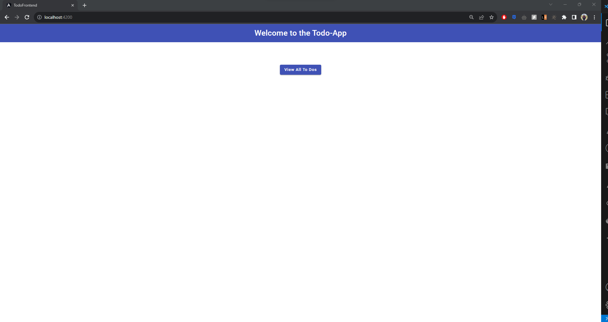
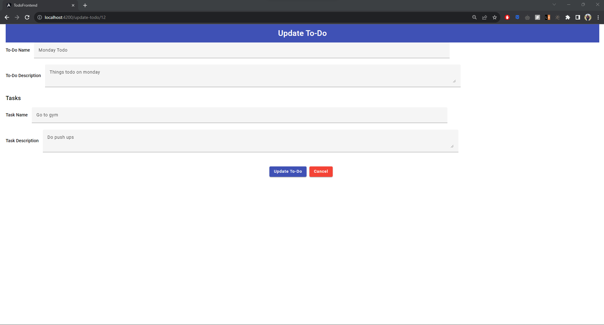
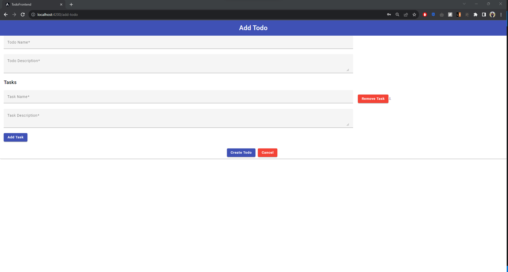
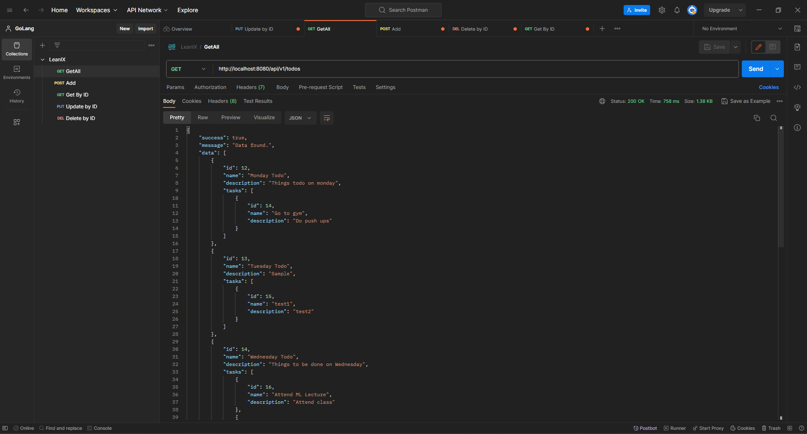
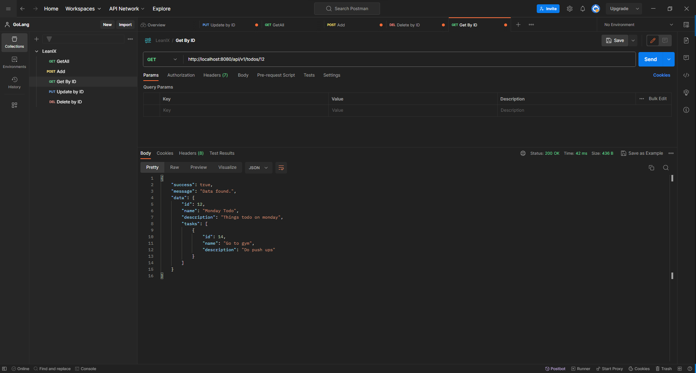
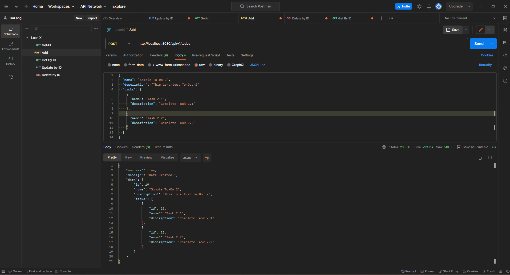
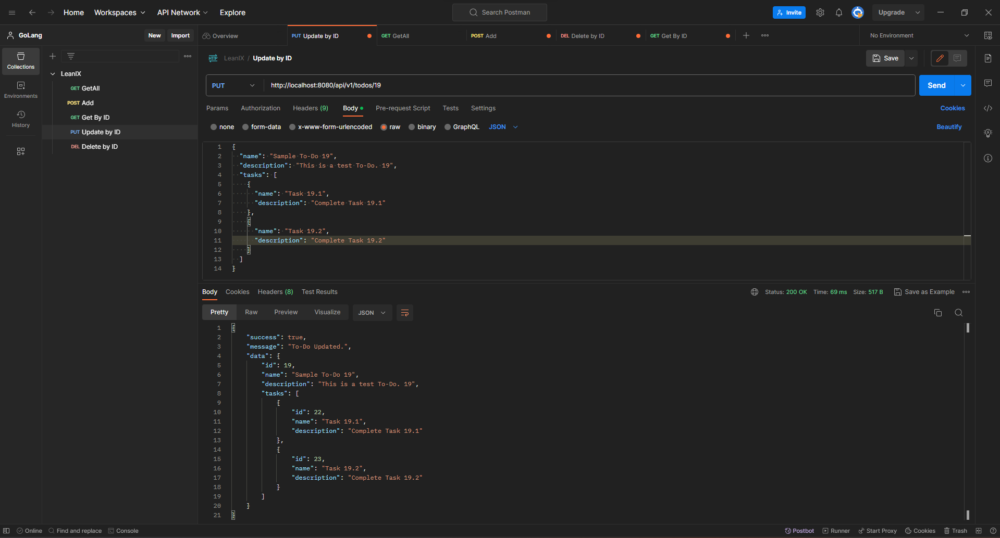
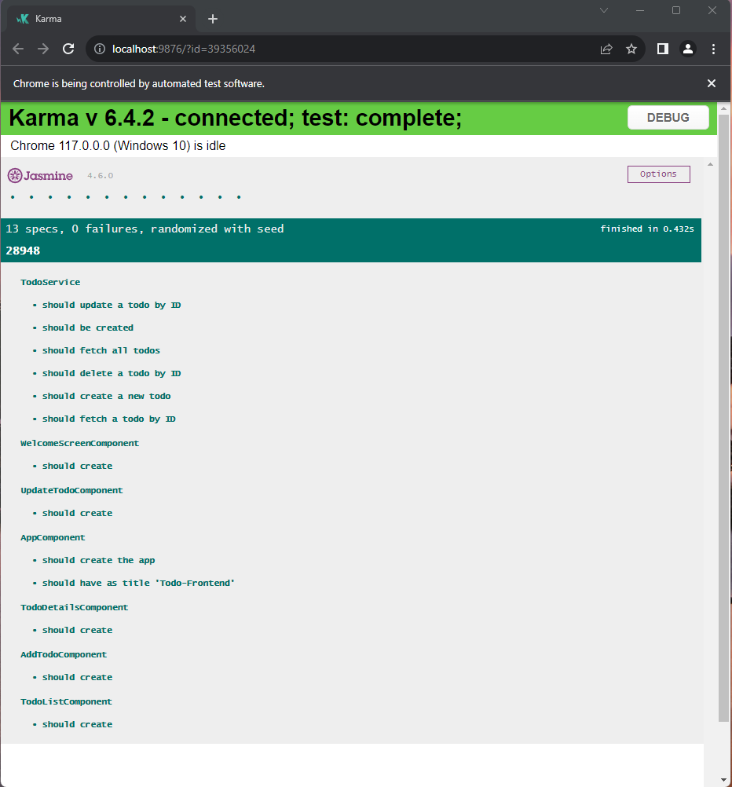
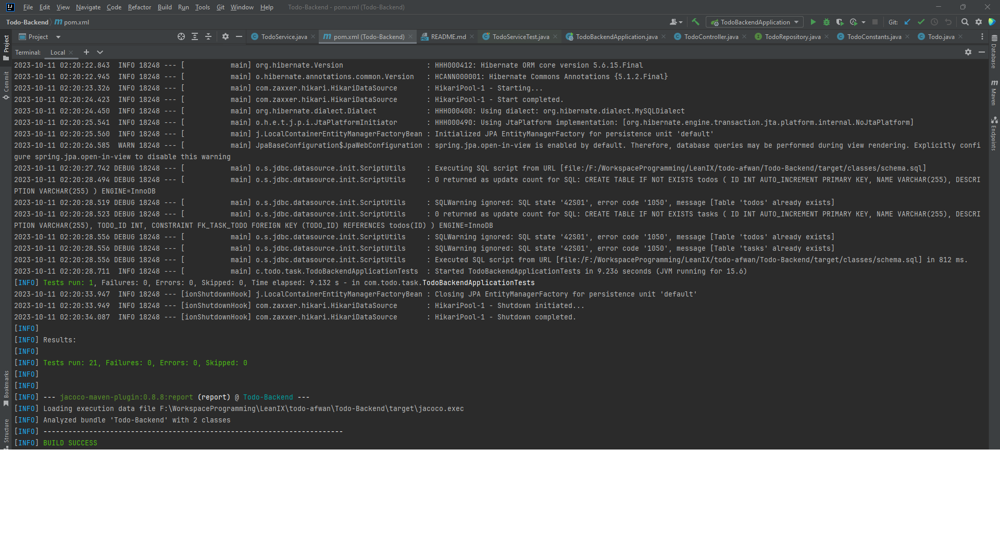

# Home Assignment - EAM P3 Senior Fullstack Engineer


# Todo Application

This is a simple Todo application built using Angular for the frontend and Java Spring Boot for the backend.

## Todo-Frontend

The `Todo-Frontend` folder contains the frontend part of the application built with Angular. It provides a user interface for managing todos.

### Getting Started

To run the frontend application, follow these steps:

1. Navigate to the `Todo-Frontend` folder.
2. Install the dependencies by running:

    ```bash
    npm install
    ```

3. Start the development server by running:

    ```bash
    ng serve
    ```

4. Access the application in your web browser at http://localhost:4200.

### Screenshots

#### Welcome Screen


#### List of Todos


#### Todo Details


#### Update Todo


#### Add Todo


## Todo-Backend

The `Todo-Backend` folder contains the backend part of the application built with Java Spring Boot. It provides API endpoints for managing todos.

### Getting Started

To run the backend application, follow these steps:

1. Navigate to the `Todo-Backend` folder.
2. Build and run the Spring Boot application.
    ```bash
    ./mvnw spring-boot:run
    ```
3. Access the API endpoints at http://localhost:8080.

### Screenshots

#### Get All Todos


#### Get Todo By Id


#### Create Todo


#### Update Todo


#### Delete Todo


## Unit Test Results

### The following screenshots show the results of running unit tests for the frontend and backend applications.

#### Frontend Unit Test Results


#### Backend Unit Test Results


JaCoCo Test Coverage Report


## Contributores

- Mohammed Afwan