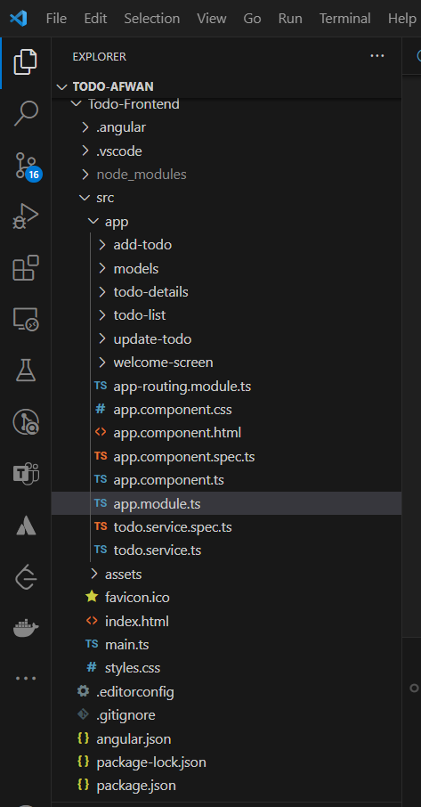

# Todo Frontend Angular Project

This is a simple Angular frontend project for managing todo lists. It provides a user-friendly interface for creating, viewing, updating, and deleting todo items. Below, you'll find some key information about the project's structure and components.

## Getting Started

To run this Angular application, follow these steps:

1.  Ensure you have Node.js (v16.2.0) and npm (v7.8.0) (Node Package Manager) installed on your machine.

2.  Install the Angular CLI (v16.2.4) globally using the following command:

    ```bash
    npm install -g @angular/cli@16.2.4
    ```

3.  Navigate to the project directory and install the project dependencies using the following command:

    ```bash
    npm install
    ```

4.  Run the application using the following command:

        ```bash
        ng serve
        ```

    This will start the development server, and you can access the application in your web browser at http://localhost:4200.

## Usage

- Welcome Screen: The initial screen provides a button to navigate to the todo list.

- Todo List: View a list of all todo items. Click on an item to view its details or update it.

- Todo Details: Display details of a specific todo item. You can also update or delete the item from this screen.

- Add Todo: Add a new todo item. You can specify a name, description, and tasks associated with the todo.

- Update Todo: Update an existing todo item. You can modify the name, description, and tasks.

## Running Tests

This project includes unit tests for components and services. You can run tests using the following command:

    ```bash
    ng test
    ```

## Project Structure



## Technologies Used

- Angular (v16.2.8): A popular JavaScript framework for building web applications.

- Angular Material (v16.2.7): A UI component library for Angular applications.

- HttpClient: Angular's module for making HTTP requests to a backend API.

- Reactive Forms: Used for handling form data and validation.
